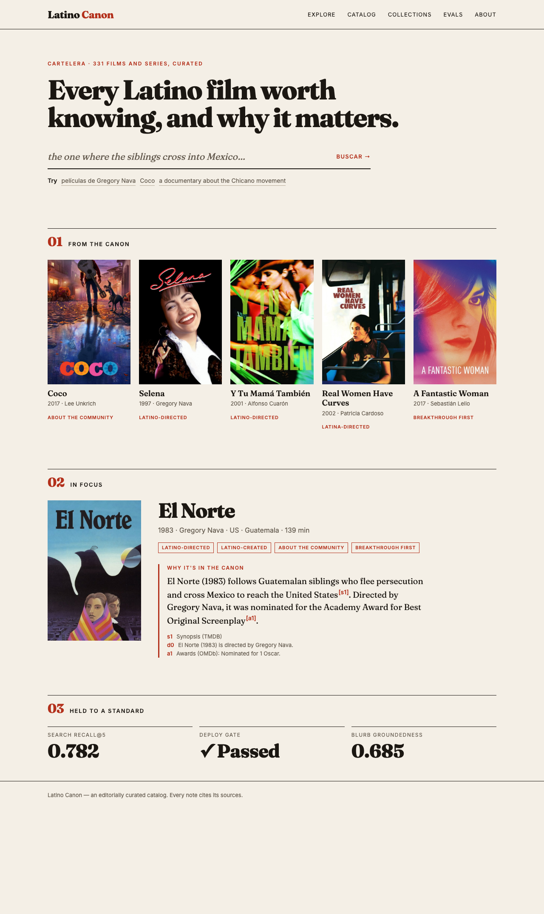
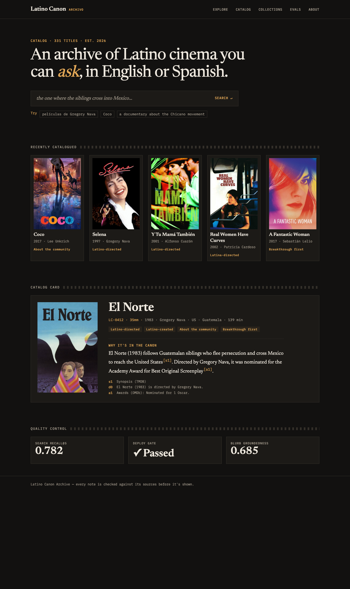
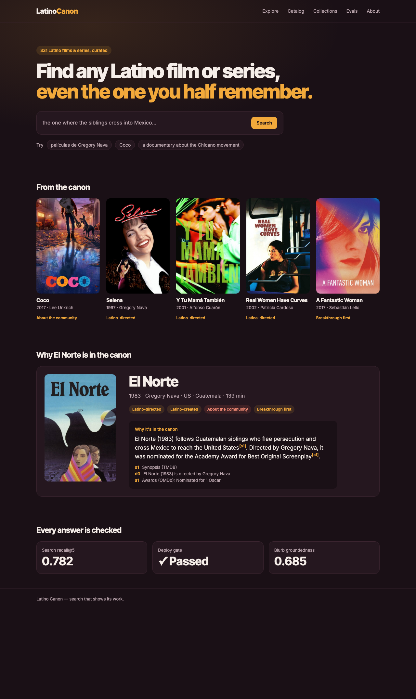

# Visual identity: three directions

**Status:** proposal, for a decision. Nothing here changes the live site.
**Mockups:** `docs/design/identity/*.html`, generated by `identity/generate.py`, with screenshots next
to them.

## Why change the identity

The site's design system ([DESIGN_SYSTEM_ROADMAP.md](../DESIGN_SYSTEM_ROADMAP.md), "Premium. Intelligent.
Alive.") is deep indigo, purple-to-magenta gradients and glassmorphism. That's the most common look of
AI products in 2024–26. It says "AI app", and it could be any AI app. Nothing in it says **cinema**,
**curation**, or **Latino**, which are the three things this project is.

The directions below take their identity from **film culture**: festival programs, archives and posters.
The posters already carry most of the color and most of the Latino visual culture, so the frame around
them should be quieter and more editorial. Each direction deliberately avoids folk-art shorthand
(papel picado, sugar skulls, serapes). It flattens many countries and cinemas into one, and the
canon's own criteria reject that kind of generalization.

All three mockups use the same real content: five canon titles with their live posters, a title detail
for *El Norte*, and three live eval numbers. So only the design differs. The *El Norte* note is a sample
in the blurb gate's style (sourced facts, inline citations), not the live blurb.

## 1. Cartelera: the festival program

| | |
|---|---|
| **Feels like** | The printed program of a film festival (Morelia, Guadalajara, Havana): editorial, confident, curated |
| **Palette** | Paper `#f4efe6`, ink `#1b1712`, one cinnabar accent `#b3301b`, muted `#655c50` |
| **Type** | Fraunces (display serif) for titles and the "why it matters" note; Inter for UI and metadata |
| **Signature moves** | Numbered sections (01, 02, 03), full-width ink rules, square posters, small-caps metadata, the note set like a program entry with a cinnabar rule |
| **Contrast** | Text 15.6:1, muted 5.7:1, accent 5.5:1 on paper (AA for all text) |

**Strengths:** the most distinctive of the three, and furthest from the AI-template look. It reads as
*curation*, which is the product's actual claim, and the posters pop on paper. The note-as-program-entry
makes the sourced blurb feel authoritative.
**Costs:** a light theme is the biggest change from today, and film sites usually go dark. It needs a
real dark mode (see "Recommendation").

## 2. Filmoteca: the archive

| | |
|---|---|
| **Feels like** | A cinemateca's catalog (UNAM's Filmoteca, the Cinemateca Brasileira): archival, precise, a little nocturnal |
| **Palette** | Warm charcoal `#121110`, surface `#1c1a17`, tungsten amber `#e3a857`, muted `#a39a8c` |
| **Type** | Newsreader (serif) for titles and notes; IBM Plex Mono for catalog metadata; Inter for UI |
| **Signature moves** | Catalog-card title detail (an index number, "35mm"), a film-perforation rule on section heads, mono metadata, amber citations |
| **Contrast** | Text 15.6:1, muted 6.8:1, accent 9.0:1 |

**Strengths:** stays dark, which suits posters and viewing, and it tells a strong story: an archive you
can *ask*. The mono metadata suits a project whose differentiator is showing its work (citations,
evals).
**Costs:** the archive framing can feel retro or institutional for recent titles like *Selena: The
Series*. The perforation motif should stay a single accent, or it becomes a theme-park prop.

## 3. Atardecer: today's site, warmer

| | |
|---|---|
| **Feels like** | The current site at dusk: same structure and dark base, without the purple glass |
| **Palette** | Plum-black `#1a1016`, surface `#25171f`, marigold `#f2a93b`, terracotta `#e0634f` (sparingly), muted `#bfaab2` |
| **Type** | Inter Tight (display) and Inter, all sans |
| **Signature moves** | Solid surfaces instead of glass, a marigold primary action, pill tags, one soft warm glow behind the hero |
| **Contrast** | Text 16.2:1, muted 8.5:1, accent 9.3:1 |

**Strengths:** the smallest change. It's mostly token swaps in `globals.css`, keeping every component and
layout, and it removes the generic purple.
**Costs:** the least distinctive. It fixes "this looks like an AI template" without answering "what does
this look like instead".

## Effort

| | Tokens (`globals.css`) | Fonts | Components | Layout |
|---|---|---|---|---|
| Atardecer | Swap | Inter Tight | Minor (drop glass classes) | None |
| Filmoteca | Swap | Newsreader, Plex Mono | Title detail becomes a catalog card; section rule | Small |
| Cartelera | Swap + light theme | Fraunces | Section headers, cards, note block | Moderate (numbered sections, rules) |

All three keep the Eval page redesign (#272), because its tiles and charts use tokens. Charts keep one
data hue per chart; the new accent becomes that hue once it's checked against the surface with the
palette validator.

## Recommendation

**Cartelera as the identity, with a dark mode built from Filmoteca's palette.** Cartelera is the only
direction that makes the product's claim (a curated canon, not a feed) visible at a glance, and it's the
strongest break from the AI-template look. Filmoteca's warm charcoal and amber are a natural dark theme
for the same system, so readers who prefer dark aren't forced into paper. Atardecer is the fallback if
the change needs to be small before the talk.

**Decide:** 1, 2, 3, or the Cartelera + Filmoteca combination. Implementation follows as its own PR: tokens
first, then the home page, title page and cards, checked with screenshots at desktop and mobile widths.
